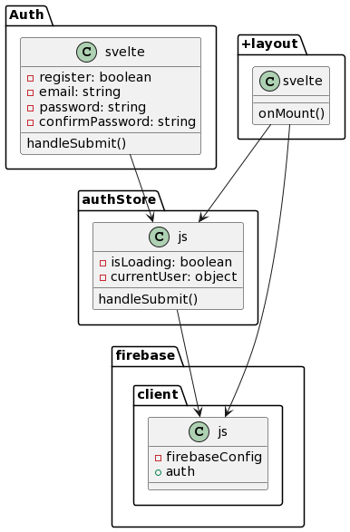

# Firebase Sveltekit Authentication

here is the high-level architecture of the Firebase Authentication implementation:

- authStore.js:
  - This file defines the authStore, which is a writable store responsible for managing the authentication-related state.
      It exports authStore to make it accessible from other parts of the application.
      The store has an initial state with two properties: isLoading (representing whether the authentication process is loading) and currentUser (representing the currently authenticated user).
      The handleSubmit function handles the form submission and performs authentication actions based on the form input values.
      If authentication is successful, the currentUser property of the authStore is updated, and the user is redirected to the private dashboard page.

- firebase.client.js:
  - This file initializes the Firebase SDK using the provided Firebase configuration.
      It exports the auth object, which represents the Firebase Authentication service.

- Auth.svelte:
  - This component represents a form for user authentication (login or registration).
    It imports the authHandlers and authStore from authStore.js.
    The form inputs (email, password, confirmPassword) are bound to component variables for user input.
    The handleSubmit function is called when the form is submitted. It uses the authHandlers from authStore to perform the appropriate authentication action based on the form inputs.
    If authentication is successful, the user is redirected to the private dashboard page.

- +layout.svelte:
  - This is a layout component that is applied to multiple routes in the application.
    It imports the onMount function from Svelte, the auth object from firebase.client.js, and the authStore from authStore.js.
    The onMount function is called when the component is mounted. It sets up an event listener using auth.onAuthStateChanged to track changes in the authentication state.
    When the authentication state changes, the authStore is updated with the new currentUser value, and the isLoading flag is set to false.
    If there is no authenticated user and the loading state is finished, the user is redirected to the home page ("/").
    The component renders the <slot /> to display the content of the specific route.

Based on this architecture, the application follows a pattern where the authStore manages the authentication state, the firebase.client.js file initializes Firebase Authentication, the Auth.svelte component handles user authentication, and the +layout.svelte component manages the authentication state and redirects users based on their authentication status.

Overall, this architecture allows for the management of authentication state and provides the necessary components and functions to handle user authentication using Firebase Authentication within a SvelteKit application.

References:

- Github: <https://github.com/jamezmca/sveltekit-auth/tree/main>
- Youtube: <https://www.youtube.com/watch?v=8NlUTFppJkU>
